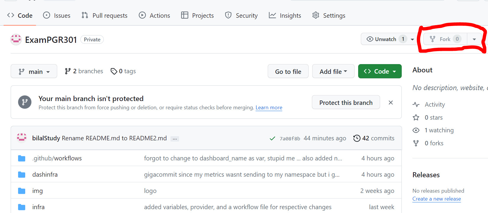
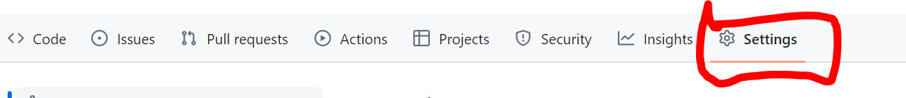
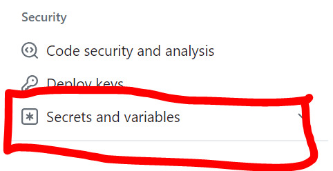
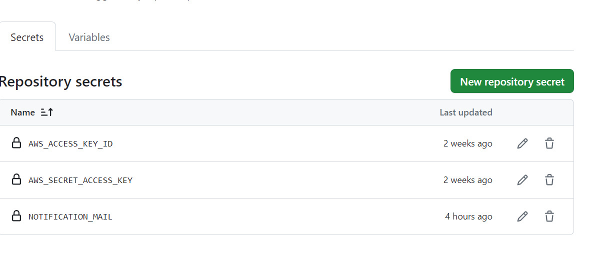

# EXAMPGR301

## Viktig Info
Gjennom oppgaven fungerte ikke aws credentialsene mine men etter å ha sett kunnkjøring så brukte jeg:

```sh   
export AWS_ACCESS_KEY_ID=”LEGG_INN_KEY_HER”
export AWS_SECRET_ACCESS_KEY=”LEGG_INN_SECRET_KEY“
export AWS_DEFAULT_REGION=eu-west-1
```

kan også være en ide og bruke aws configure:
```sh   
aws configure
```

## Hva må gjøres for å kunne kjøre dette repo fra fork?

Sensor vil lage en fork av ditt repository. Forklar hva sensor må gjøre for å få GitHub Actions workflow til å kjøre i sin egen GitHub-konto?



generer token fra github


lag secrets slik

trykk på settings 


trykk derreter på secrets


og lag secrets for disse tre verdiene



```sh   
AWS_ACCESS_KEY_ID="DIN_ACCESS_KEY_ID"
AWS_SECRET_ACCESS_KEY="DIN_SECRET_ACCESS_KEY"
NOTIFICATION_MAIL="DIN_MAIL_DU_VIL_HA_NOTIFIKASJON_TIL"
```
Hvis du trenger hjelp til å lage aws nøkler så logger du inn på aws, trykker på profilen din øverst til høyre, deretter trykker du på security credentials, gå ned til access key, å lag en ny en

## Viktig
Viktig at du legger til alle secretsene for at terraform kode og workflows skal fungere som de skal

## Terraform
Se på dokumentasjonen til aws_apprunner_service ressursen, og reduser CPU til 256, og Memory til 1024 (defaultverdiene er høyere), 

Istedet for å bruke terraform installasjonen som kommer med Cloud9, kan vi bruke "tfenv" - et verktøy som lar oss laste ned 
og bruke ulike Terraform versjoner. Dette er veldig nyttig å kunne siden dere kanskje skal jobbe i et miljø med flere ulike 
prosjekter- eller team som bruker ulike Terrafsorm versjoner. 

```sh   
git clone https://github.com/tfutils/tfenv.git ~/.tfenv
echo 'export PATH="$HOME/.tfenv/bin:$PATH"' >> ~/.bash_profile
sudo ln -s ~/.tfenv/bin/* /usr/local/bin
```

For å se hvilke Terraform versjoner i kan velge fra -  

```sh
tfenv list-remote
```

```sh
tfenv install 1.3.3
```

Vi ser at terraform 1.3.3 er lastet ned for oss. Vi kan så gjøre 

```sh
tfenv use 1.3.3
terraform --version
```

Oppgave 4

Her utvidet jeg koden ved å lage ett nytt GET endepunkt for s3rekognition. Endepunktet sjekker om personene i bildet fra s3-bucketen har på hansker eller ikke, hvis de ikke har på hansker eller man ikke ser hendene til personen i bildet vil det regne som en violation.

Noen Curl Kommandoer for å teste api'et

husk å laste ned maven om det trengs
```sh
sudo wget http://repos.fedorapeople.org/repos/dchen/apache-maven/epel-apache-maven.repo -O /etc/yum.repos.d/epel-apache-maven.repo
sudo sed -i s/\$releasever/6/g /etc/yum.repos.d/epel-apache-maven.repo
sudo yum install -y apache-maven
```

for å kunne bruke jq for finere formattering kan du laste dette ned
```sh
sudo yum install jq
```

get for scan-ppe

```sh
curl --location --request GET 'http://localhost:8080/scan-ppe?bucketName=candidate2043'   --header 'Content-Type: application/json'|jq
```

```sh
curl --location --request GET 'http://localhost:8080/scan-ppe-hand-cover?bucketName=candidate2043'   --header 'Content-Type: application/json'|jq
```

Post for vår første medisin
```sh
curl --location --request POST 'http://localhost:8080/medical-supply' \
 --header 'Content-Type: application/json' \
 --data-raw '{
     "id": 1,
     "drugName" : "Paracet",
     "supplyBalance" : "4000"
 }'|jq
```

Andre medisin
```sh
curl --location --request POST 'http://localhost:8080/medical-supply' \
 --header 'Content-Type: application/json' \
 --data-raw '{
     "id": 2,
     "drugName" : "Ibux",
     "supplyBalance" : "5000"
 }'|jq
```
Tredje Medisin
```sh
curl --location --request POST 'http://localhost:8080/medical-supply' \
 --header 'Content-Type: application/json' \
 --data-raw '{
     "id": 3,
     "drugName" : "Pinex",
     "supplyBalance" : "7500"
 }'|jq
```
get for medisin med id
```sh
curl --location --request GET 'http://localhost:8080/medical-supply/1'   --header 'Content-Type: application/json'|jq
```


for mine metrikker la jeg til en gauge for hver medisin som lages i systemet, en gauge er en bra måte å måle noe som kan bli mindre eller større, så hvis sykehusene eller sektorene det er snakk om vil fjerne medisiner senere så gir det mening å ha dette som en gauge. Metrikken heter drug_count

Jeg la også til en gauge for total_drug_inventory som er inventaret man har av alle pakker for en hvis medisin. F.eks. så har stedet som bruker denne tjenesten et inventar av 22500 i totalt inventar, siden den har 10000 pakker av Paracet, 5000 pakker av Ibux og 7500 pakker av Pinex. I tillegg så slår alarmen for denne gaugen hvis verdien av inventaret er under 5000, dette vil slå alarm fordi vi har underskudd på medisiner i vårt inventar, og trenger da og bestille nye.

Jeg har en @Timed annotation for scanForPPE metoden vår. Slik at vi får gjennomsnittlig respons tid på scanForPPE når noen gjør et kall mot GET metoden vår.

I tillegg er det en timer som tar å måler tiden jeg bruker for kodeblokken som leser bilder og prosseserer om det er en violation eller ikke basert på om de har FACE_COVER, denne metrikken heter ppescanduration og er til stede for å kunne sammenligne hva slags tid hovedloggiken for metoden bruker.

Jeg har også samme @Timed annotation for handcoverget for scanForHandCover metoden vår. Dette gjør vi av samme grunn, slik at vi får gjennomsnittlig respons tid på scanForPPE når noen gjør et kall mot GET metoden vår.

I tillegg er det en timer som tar å måler tiden jeg bruker for kodeblokken som leser bilder og prosseserer om det er en violation eller ikke basert på om de har HAND_COVER, denne metrikken heter handcoverscanduration og er til stede for å kunne sammenligne hva slags tid hovedloggiken for metoden bruker.

Dette ser repetitivt ut, men jeg valgte å gå med denne løsningen fordi jeg kan nå sammenligne følgenede:

GET kallet for scanForPPE med GET kallet for scanForHandCover slik at vi kan se forskjellen mellom respons tid på kallene.

ppescanduration metrikken med handcoverscanduration slik at vi kan se forskjellen i tid mellom hovedloggikken i metodene, fordi det fortsatt finnes annen kode i GET metoden.

scanForPPE med ppescanduration fordi vi kan sammenligne tiden hele metodekallet tar med hovedlogikken, slik at man kan se forskjellen i tid mellom hovedlogikk kodeblokken og GET metoden.

scanForHandCover med handcoverscanduration av samme grunn som over.

Alarmen slår basert på total_drug_inventory som forklart tidligere, hvis inventaret er under 5000. alarmen slår fordi helsetjenesten har en mangel på inventar, og trenger derav å bestille mer medisiner.


5A

Kontinuerlig integrering er det å levere kode, definisjonen for det er litt annerledes basert på hvor du henter informasjonen din. Jeg vil lande på det at kontinuerlig integrering er når utviklere leverer koden sin gjennom en dag til et felles sted slik at, automatiske tester, eller bygg blir kjørt. Det er bedre å levere koden din oftere enn, en gang om dagen fordi du da kan tidligere legge merke til om noe feiler. I vårt tilfelle vil Github Actions sjekke om koden vår ikke brekker byggene den gjør, på hver commit til main branch.

Fordelene med å bruke kontinuerlig integrering vil bli at du oftere leverer små kode til ett felles sted, ofte ett repository. Hvis koden din brekker bygg, eller feiler automatiske tester legger du merke til dette ved hver anledning, og kan da justere det. Dette sparer deg som utvikler hodebry i tillegg til kollegaene dine, som slipper å få kode som skaper problemer. Du kan oppdage bugs i systemet ditt kjappere, du kan oppdage kode som brekker infrastruktur tidligere. Du kan lettere oppdage feil. Hvis du leverer kode ofte, og det bygg eller tester brekker kan du spare tid istedenfor å jobbe i lenger tid uten å levere kode. Personlig gjennom dette prosjektet har det hjulpet ekstremt ofte i terraform kode ved slurvefeil, eller i flag og variabler jeg har definert som har hatt feil navn eller mangel.

Vi jobber med CI rent praktisk ved som et felles team å levere kode ofte til github. Også har vi bygg å tester skrevet i workflow filen vår under .github/workflows/. Hvis ett bygg brekker eller tester feiler legger vi merke til det kjapt. Dette gjør arbeidsflyten for deg som utvikler bedre i tillegg til arbeidsflyten til kollegaene dine. Alle på teamet må ha forståelse for å levere kode ofte, slik at flyten for hele prosjektet er bedre.

5B1

Scrum metodikk går først og fremst ut på grunnprinsippene åpenhet, refleksjon og tilpasning. Det er viktig med god kommunikasjon og respekt for andre, og gode tilpasningsevner tillater det å prioritere hva som er viktig gjennom en sprint. I programvareutvikling går scrum ut på kvalitetesikring gjennom hva teamet har sagt kravene for funksjonalitet i koden deres skal være. Dette er ofte inndelt i mindre oppgaver, i noe som kalles en backlog av ting som må gjøres gjennom en sprint. Disse teamene baserer sprinter på kundene sine tilbakemeldinger. Teamene reflekterer ofte i daglig møter og over sprinter som er gjennomførte. Smidig metodikk kommer ofte inn her, med det å fokusere på kontinuerlig forbedring av seg selv og verdien man leverer til kunden.

Scrum har fordeler og ulemper, noen fordeler er at det kan være effektivt, kan spare bedriften/prosjektet penger, store prosjekter er inndelt i små oppgaver, ting er testet gjennom sprint tilbakemelding, teamet vet hva de skal gjøre, tar imot tilbakemeldinger fra kunder som gjør slik at du kan endre på hva som trengs underveis. Noen ulemper er at det ofte leder til scope-creep som vil si at du forventer noe skal ta kortere tid en forventet, dårlig sammarbeid mellom kollegaer ødelegger hele miljøet for trivsel og gjennomførelsen av en god jobb. Du kan ikke ha store teams, kvalitetssikring er ekstremt dårlig.

5B2

I Devops metodikk jobber man også 3 hovedprinsipper. Flyt, Feedback og Kontinuerlig læring. Man jobber som team under hele utviklingsfasen, fra utvikling til test til leveranse. Dette fører til at utviklere ikke kan gi fra seg ansvaret til andre, som er viktig for å bli en bedre utvikler. Det gjør slik at vi kan levere bedre kode for kvalitetssikring, dette fører også da til et mer effektivt arbeidsmiljø i lengden. Teamene bruker ofte automatiserte prosesser som automatiserte tester og bygg, som vi snakket om tidligere med kontinuerlig leveranse. Det er viktig og levere kode ofte. Samarbeid er viktig å prosessen med kontinuerlig integrering og leveranse fører oftere til samarbeid mellom kollegaer. En veldig viktig del av devops er automatisering, man prøver å gjøre kode så gjenbrukbar som mulig, og har kode for å gjøre ting av seg selv, ett eksempel på dette igjen er workflow kode vi har brukt. Feedback er også en veldig viktig del av disse miljøene der en bruker eller kunde er med på korte intervaller hvor brukeren er en del av disse prosessene steg-vis.

Devops har også fordeler, og ulemper. Noen fordeler er bra arbeidsmiljø, automatisering av repetitive oppgaver, redusering av kostnader brukt på grunn av effektivt arbeidsmiljø, kjappere leveranse siden teamet er en stor del av alt, reduserer bugs, leverer bedre kode. Noen ulemper kan være effektiviseringen selv ved at man ikke bruker nok tid på en arbeidsoppgave, skifte av arbeidsmiljø, all automatisering kan føre til dårligere sikkerhet. 

5B3

I forhold til min egen programvarekvalitet og leveransetempo er det både fordeler og ulemper ved hver metodikk.

Ved scrum/smidig metodikk deler man oppgaver inn i veldig små deler slik at man kan jobbe mot ett større mål, også leverer dette for testing, dette har ført til at jeg får skrevet et stort kodevolum, mye kjappere. Jeg får jobbet på funksjonalitet som trengs, deretter kan jeg bearbeide kode etter mine egne krav eller etter sprint. Men dette kan også føre til scope-creep.

Ved Devops metodikk jobber jeg saktere, men har høyere programvarekvalitet. Dette er fordi hver del av funksjonalitet jeg legger til må fungere for mine actions bygg. Nå har jeg ikke jobber stort med tester i devops, eller i team med devops metodikk så jeg kan dessverre ikke si noe på det.

Jeg kan se for meg det å jobbe i devops team kan oftere være bedre enn det å jobbe i scrum team. Alle parter må samarbeide, og uforventede hendelser fører til at ett scrum team kan knekke. Hvis en i scrum teamet ditt slutter, eller noen er misfornøyde på jobb så er det å jobbe scrum mye mindre effektivt en det skal være. Derimot hvis miljøet er bra kan jeg se for meg at det kan være veldig effektivt.

5C

Feedback går ut på at en feil kommer til å skje uansett, så det å få tilbakemelding fra brukere er viktig, så det er utrolig viktig å se feil gjennom korte intervaller. For å minske store feil og små feil.

Ny funksjonalitet levert i denne oppgaven var blant annet GET metoden min scanForHandCover, jeg la allerede merke til feil denne metoden har pågrunn av svakheter i s3rekognition, av og til kan de hende tjenesten ikke registrer hansker i det hele tatt, av og til kan de hende den ikke finner hender siden de er skjult så en violation er sann, som kan være en falsk positiv. Ved kjapp tilbakemelding fra bruker kan jeg nå legge til ny kode eller endre kode allerede etablert. Det kan f.eks være en ide og se om en hånd har på en hanske istedefor begge, med tanke på at du mest sannsynlig har på begge hansker hvis du først har på en.

Slik tar feedback og bidrar kjapt til endring av tjenesten. 
